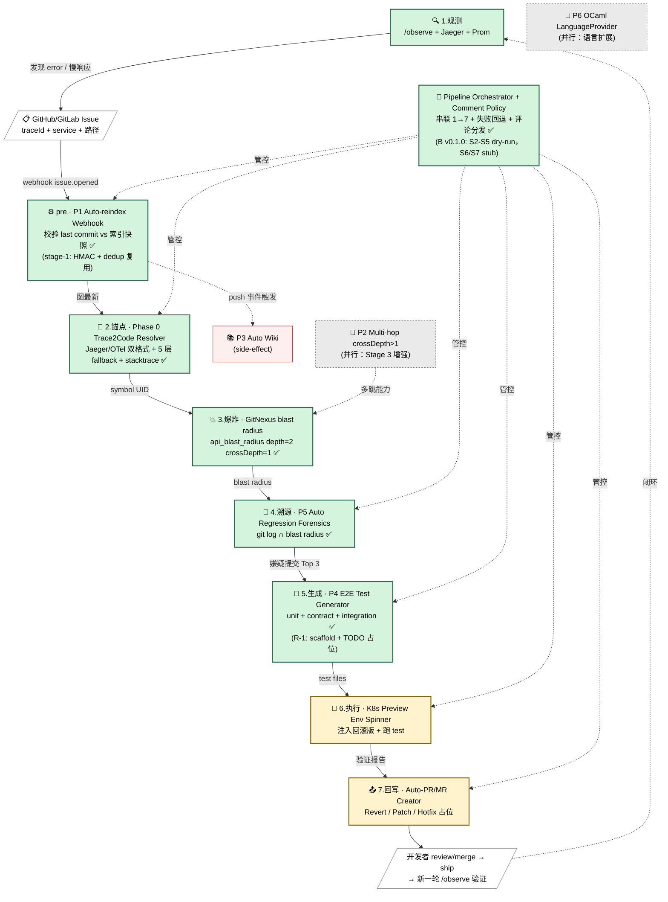

# 团队自建版 GitNexus 企业版 —— 7 阶段 Agentic DevOps 闭环路线图 v2

> 作者：GitNexus 核心维护者视角
> 日期：2026-04-28
> 状态：**review 通过**（gitnexus-knowledge 事实校对 + gitnexus-dev 独立评审，2 处硬 bug + 4 处细节修正已合入）
> 上一版：`docs/learn/PR-Review-Bot-方案.md`（2026-04-26，P0 PR Review Bot 已上线）

---

## 0. 项目目标

### 0.1 一句话定位

> **把现有零散资产（/observe + Jaeger/Prom + GitNexus OSS + git + K8s + GitHub/GitLab）串成一条从"线上出错"到"自动开 PR 修复"的 7 阶段 Agentic DevOps 闭环 —— 团队自建版的 GitNexus 企业版。**

更进一层的目标：**把整个研发生命周期，从"人驱动的流程"翻译成"Agent 可执行的协议"。**

GitNexus 在这个目标里扮演**确定性知识基础设施**——给 Agent 提供"代码的真相"，是闭环里**唯一不靠 LLM 的层**。上层编排会抖动、观测会缺失、LLM 输出会幻觉，但 GitNexus 给的"X 改动会影响 Y"（blast radius）是**索引时算好的事实**，可以被 Agent 当作硬约束信任。

### 0.1.1 vs GitNexus 官方 Enterprise

| 官方 Enterprise | 本路线图（团队自建版）|
|---|---|
| PR Review + Auto Wiki + Auto-reindex + Multi-repo + OCaml | OSS + Phase 0 + P5 + P4 + 自家 K8s preview + 自家 Auto-PR + 自家 /observe |
| 闭环到"PR 评论" | 闭环到 **PR/MR 自动生成 + preview env 验证** |
| 单产品形态 | **把 OSS 当 SDK**，拼出更贴合团队的研发自动化平台 |

### 0.2 7 阶段 Agentic DevOps 闭环

> 编码侧 coding 闭环（brainstorm / plan / exec / review / ship）由独立编排系统主导，**不在本路线图范围**。
> **本路线图聚焦运行时侧 7 阶段闭环**：从线上出错 → 锚点 → 爆炸 → 溯源 → 生成 → 执行 → 自动开 PR/MR。

#### 可视化总览



**图例**：
🟢 绿色 = 已有（OSS / 外部已就绪）；🟡 黄色 = 本路线图新增；🔵 蓝色 = 横切层；
🔴 粉色 = side-effect；⚪ 灰色 = 并行线；空白 = 外部触发 / 闭环。

#### 详细文字说明

```
═══════════════════════════════════════════════════════════════
【1.观测】 /observe (Jaeger + Prom 巡检)               外部已有 ✅
═══════════════════════════════════════════════════════════════
   定期 cron / 手动 → 监听 Jaeger trace + Prom 指标
   发现 error / 高响应时间 / SLO 违约
   → 自动建 GitHub/GitLab Issue
     (body 含 traceId + service + 路径 + 时间窗 + 指标 snapshot)
                                  │ webhook (issue.opened)
                                  ▼
   ┌─ precondition · P1 Auto-reindex Webhook ──────────┐
   │ 校验目标仓 last commit vs 索引快照                 │
   │ stale → gitnexus analyze（staleness 早退幂等）    │
   └──────────────────────┬─────────────────────────────┘
                          ▼ 确保 Stage 3-5 用最新图
═══════════════════════════════════════════════════════════════
【2.锚点】 Trace2Code Resolver                         Phase 0 新增 🟡
═══════════════════════════════════════════════════════════════
   trace span → handler symbol UID
   - Jaeger tags[] ↔ OTel attrs{} 双格式
   - 5 层 HTTP fallback：http.route → url.path → url.full
                        → http.url → http.target
   - stacktrace 顶帧反查（OTel exception event 独有）
                                  │ symbol UID
                                  ▼
═══════════════════════════════════════════════════════════════
【3.爆炸】 GitNexus blast radius                       OSS 已有 ✅
        depth=2, cross_depth=1
═══════════════════════════════════════════════════════════════
   impact(handler, both, depth=2, crossDepth=1)
   → 受影响符号集（upstream + downstream）
   → 跨仓波及面（contract registry）
   → 四轴风险评级（CRITICAL/HIGH/MEDIUM/LOW）
                                  │ 受感染范围 = blast radius
                                  ▼
═══════════════════════════════════════════════════════════════
【4.溯源】 Auto Regression Forensics                   P5 新增 🟡
        git log ∩ blast radius
═══════════════════════════════════════════════════════════════
   git log(HEAD~N..HEAD --format='%H %at') 拿近期变更 + 时间戳
   ∩ blast radius（含 handler 文件路径过滤防误报）
   rank by 时间近度 × confidence
                                  │ 嫌疑提交 Top 3
                                  ▼ (commit + method + 时间)
═══════════════════════════════════════════════════════════════
【5.生成】 E2E Test Generator                          P4 升级关键路径 🟡
        unit + contract + integration
═══════════════════════════════════════════════════════════════
   沿 Process / STEP_IN_PROCESS / ENTRY_POINT_OF 走调用链
   → 生成三层测试：
     - unit       (handler 单元，孤立函数级)
     - contract   (跨仓接口契约，provider/consumer 对齐)
     - integration(端到端调用链，复现 trace 路径)
   → 输出可执行 test 代码（语言+框架自适应）
                                  │ test files
                                  ▼
═══════════════════════════════════════════════════════════════
【6.执行】 K8s preview env 跑测试                      部署侧新组件 🟡
═══════════════════════════════════════════════════════════════
   spin up preview env（vCluster / Argo CD / 自建 GitOps）
   - 注入嫌疑提交回滚版本
   - 跑 Stage 5 生成的 test
   - 收集结果 → 验证"嫌疑提交是不是真凶"
                                  │ test result + 验证报告
                                  ▼
═══════════════════════════════════════════════════════════════
【7.回写】 Auto-PR/MR (GitHub/GitLab)                  平台侧新组件 🟡
═══════════════════════════════════════════════════════════════
   组装：
   - fix proposal（基于 Stage 4 嫌疑提交的 revert 或 patch 草稿）
   - test 文件（Stage 5 生成的三层 test）
   - forensics 报告（Stage 4 + 6 全留痕）
   → 调 GitHub/GitLab API 自动开 PR/MR
   → 关联原 Issue + 按 comment-policy.yaml 路由评论目标
   → 闭环：开发者 review/merge → ship → 新一轮 /observe 验证
```

**为什么 Stage 3 是 GitNexus 招牌能力**：blast radius 不调 LLM、不做概率匹配，**完全基于索引时算好的边**。
其他 6 个 stage 可以用任何工具替换（巡检换 Datadog、preview env 换 spin、PR 换 GitLab），
但 Stage 3 的"X 改动会影响 Y"必须有一个确定性图谱在背后撑着 —— **这是整套闭环可信任性的 anchor**。

**precondition（P1 Auto-reindex）的隐藏价值**：保证每次进 Stage 3 时图都是最新的。这是 Stage 3 可信的前提。

### 0.3 7 阶段对应的功能映射

| Stage | 名称 | 落地组件 | 状态 |
|---|---|---|---|
| pre | 索引保鲜 | **P1 Auto-reindex Webhook** | 🟡 关键路径 |
| **1** | **观测** | `/observe` skill + Jaeger + Prom | ✅ 已有（外部，业务零侵入） |
| **2** | **锚点** | **Phase 0 Trace2Code Resolver**（原名 Jaeger Span Normalizer）| 🟡 本路线图新增 |
| **3** | **爆炸** | GitNexus `impact()` + contract registry（crossDepth=1）| ✅ OSS 已有，仅参数化包装 |
| **4** | **溯源** | **P5 Auto Regression Forensics** | 🟡 本路线图核心 |
| **5** | **生成** | **P4 E2E Test Generator**（升级关键路径，含 unit + contract + integration）| 🟡 本路线图新增 |
| **6** | **执行** | K8s preview env spinner（vCluster / Argo CD / 自建 GitOps）| 🟡 部署侧新组件 |
| **7** | **回写** | Auto-PR/MR creator + GitHub/GitLab API + comment-policy.yaml | 🟡 平台侧新组件 |

**并行线（"团队自建版"完整性的一部分，不在 7 阶段主链路）**：

| 功能 | 用途 |
|---|---|
| **P2 Multi-hop crossDepth>1** | Stage 3 爆炸增强：跨仓多跳追源头 |
| **P3 Auto Wiki 刷新** | side-effect：merge 后 wiki 自动重生成（搭 P1 webhook 顺风车）|
| **P6 OCaml LanguageProvider** | 语言扩展，独立线 |
| **Pipeline Orchestrator + Comment Policy** | 把 Stage 1→7 串成有错误兜底 / 超时 / 并发 / 评论分发的薄编排层 |

---

## 1. 现状（2026-04-28）

| 功能 | Pri | 状态 | 7 阶段对应 | 备注 |
|---|---|---|---|---|
| **PR Review Bot** | P0 | ✅ 已上线 | — | 含 `crossDepth=1` 跨仓影响分析；GitHub App `gitnexus-pr-reviewer-zxs` 已发布；不在 7 阶段闭环里 |
| `/observe` skill + Jaeger + Prom | — | ✅ 已有 | **Stage 1** | 外部，业务零侵入 |
| GitNexus `impact()` blast radius | — | ✅ OSS 已有 | **Stage 3** | 仅需参数化包装（depth=2, crossDepth=1）|
| Auto-reindex Webhook | P1 | 🟡 未做 | **pre** | 索引保鲜，确保 Stage 3-5 用最新图 |
| Phase 0 Trace2Code Resolver | — | 🟡 未做 | **Stage 2** | 原 Jaeger Span Normalizer 改名 |
| Auto Regression Forensics | P5 | 🟡 未做 | **Stage 4** | git log ∩ blast radius |
| E2E Test Generator | P4 | 🟡 未做 | **Stage 5** | **升级到关键路径**（unit + contract + integration） |
| K8s preview env spinner | — | 🟡 未做 | **Stage 6** | 部署侧新组件（vCluster / Argo CD / 自建）|
| Auto-PR/MR creator | — | 🟡 未做 | **Stage 7** | 平台侧新组件（GitHub/GitLab API）|
| Multi-hop crossDepth>1 | P2 | 🟡 未做 | Stage 3 增强 | 并行线 |
| Auto Wiki 刷新 | P3 | 🟡 未做 | side-effect | 搭 P1 webhook 顺风车 |
| **Pipeline Orchestrator + Comment Policy** | — | 🟡 未做 | 横切 | 把 Stage 1→7 串成有错误兜底 / 超时 / 并发 / 评论分发的薄编排层 |
| OCaml LanguageProvider | P6 | 🟡 未做 | — | 并行线 |

---

## 2. 路线图 v2（按 Agentic DevOps 闭环优先重排）

### 2.1 关键路径 vs 并行线

```
═══════════════════════════════════════════════════════════════
7 阶段闭环关键路径（串行，6.5 周端到端跑通 Stage 1 → 7）：
═══════════════════════════════════════════════════════════════

P1  Auto-reindex Webhook（1 周）                  ← pre
   │   webhook server + job-queue（同 repo 去重）
   │
   ▼
Phase 0  Trace2Code Resolver（1 周）              ← Stage 2
   │   双格式归一 + 5 层 fallback + stacktrace 兜底
   │
   ▼
Blast Radius 参数化包装（0.5 周）                 ← Stage 3
   │   impact(depth=2, crossDepth=1) MCP 工具增强
   │
   ▼
P5  Auto Regression Forensics（1 周）             ← Stage 4
   │   git log ∩ blast radius + 文件路径过滤
   │
   ▼
P4  E2E Test Generator（2 周）                    ← Stage 5
   │   unit + contract + integration 三层
   │
   ▼
K8s Preview Env Spinner（1.5 周）                 ← Stage 6
   │   vCluster/Argo CD 接入 + 注入回滚版 + 跑 test
   │
   ▼
Auto-PR/MR Creator（1 周）                        ← Stage 7
   │   GitHub/GitLab API + fix proposal 模板
   │
   ▼
Pipeline Orchestrator + Comment Policy（0.5 周）  ← 横切
       串联 1→7 + comment-policy.yaml + 评论分发

P3 Auto Wiki 刷新（0.5 周）—— 顺手挂 P1 webhook，不阻塞主链路

═══════════════════════════════════════════════════════════════
并行线（互不阻塞主管线）：
═══════════════════════════════════════════════════════════════

P2  Multi-hop crossDepth>1（1.5 周）              ← Stage 3 增强
P6  OCaml LanguageProvider（2 周）                ← 语言扩展

═══════════════════════════════════════════════════════════════
总工期：
- 单人串行：8-9 周（含 P3）
- 双人并行：5-6 周（线 A 主链 / 线 B 并行 P2+P6+K8s）
- 三人并行：4-5 周（额外一人专攻 K8s preview env + Auto-PR）
═══════════════════════════════════════════════════════════════
```

### 2.2 关键修正点（v1 → v2）

review 抓出 **2 处硬 bug + 4 处细节**，已经全部合入：

| 编号 | 严重度 | v1 错误 | v2 修正 | 源码锚点 |
|---|---|---|---|---|
| Bug-1 | 中（防御） | Phase 0 用 `normalizeHttpPath` 查 Route，**只折叠 `:id`/`{id}`/`[id]`，不识别裸数字段** | 改用 `normalizeConsumerPath`，把 `/api/users/123 → /api/users/{param}`；lookup 加置信度排序（exact > consumer-normalized） | `gitnexus/src/core/group/extractors/http-route-extractor.ts:61,78` |
| Bug-2 | 高 | P5 排在 P2 后，等 multi-hop 完成 | **P5 不阻塞 P2**：crossDepth=1 大多数场景够用，P2 后续增强深度而非门槛 | — |
| Fix-1 | 高 | P5 `suspects = detect_changes ∩ (upstream ∪ downstream)` 太宽（同期 unrelated 变更全误归） | 加**文件路径过滤**：只交叉 handler symbol 所在文件的直接改动 | `regression-forensics.ts`（新建） |
| Fix-2 | 中 | `detect_changes` 不返回 commit timestamp，"时间近度"排序无据 | forensics 层自跑 `git log --format="%H %at"`，不改 `detect_changes` 接口 | — |
| Fix-3 | 中 | P1 `job-queue` 没去重，force-push 20 次会打满 worker pool | 同 repo 入队去重：pending job 列表已有同 repo → 丢弃新 job | `server/job-queue.ts`（新建） |
| Fix-4 | 中 | P2 `mergeRisk(localRisk, cross)` 不接受 depth；`cross.length>=3 → CRITICAL` 在多跳后假性触发 | 改签名加 `maxCrossDepth`，深度衰减 `0.85^depth`；只对 depth=1 保留原阈值 | `gitnexus/src/core/group/cross-impact.ts:253` |
| Fix-5 | 中 | P2 `closeBridgeDb` finally 只关本地，多跳打开多个 group bridge 会泄漏句柄 | 每个 bridge handle 进 finally 关 | `gitnexus/src/core/group/cross-impact.ts:519` |
| Fix-6 | 中 | P6 `importSemantics: 'wildcard-leaf'` 一刀切，OCaml `open` vs `include` 语义不同 | 在 `ocaml.ts:resolveImport` hook 区分 AST：`open` → `wildcard-leaf`；`include` → `wildcard-transitive`（参考 `c-cpp.ts:324`） | — |
| Fix-7 | 中 | P6 直接进 `MIGRATED_LANGUAGES` 走 RFC #909 新路 | 走旧 DAG 路（不实现 `emitScopeCaptures`，不进 `MIGRATED_LANGUAGES`），等 grammar 成熟再迁移 | `gitnexus/src/scope-resolution/registry-primary-flag.ts:67` |
| Fix-8 | 低 | P4 BFS 没说防递归 | `process-traversal.ts` BFS 加 visited set | — |
| Fix-9 | 低 | P5 主动拉 Jaeger 假设过重 | 改**被动推**：caller POST span 数组进 MCP tool | — |

### 2.3 Stage 5 / 6 / 7 评审修正点（gitnexus-dev 第二轮 review）

新增 Stage 5（E2E Test Gen 升级）/ 6（K8s Preview Env）/ 7（Auto-PR）后，gitnexus-dev 抓出 **6 高 + 8 中 + 4 低** 风险。**3 个高风险必须在动工前拍板，不是实现时再说**：

#### 🔴 高风险 Top 6（必须修）

| # | Stage | 问题 | 修正方案 |
|---|---|---|---|
| **R-1** | 5 | **fixture 数据从静态调用链推断不出来**（DB 外键 / 微服务 mock schema）| `integration-gen` 降期望：先生成"调用链结构骨架 + TODO 占位"，**不强求自动填值域**。Stage 6 验证目标改为"调用链能不能通"，业务正确性留给开发者补 |
| **R-2** | 6 | **嫌疑提交回滚版镜像可能根本不存在**（CI 已 GC、tag 已删）| `image-injector.ts` 三级降级：1) `image:<sha>` 精确拉；2) 查 CI artifact 缓存 layer；3) on-demand `docker build --target test`；4) 全失败 → Stage 6 跳过，Stage 7 降 Hotfix 占位 |
| **R-3** | 6 | **`validate_in_preview` 同步等结果在 MCP 协议下不现实**（拉起 30-120s + 跑 test 几分钟）| 改异步 job 模式：tool 立刻返回 `{jobId, statusUrl}`，加新 tool `check_preview_status({jobId})` 轮询。Pipeline Orchestrator 编排等待逻辑 |
| **R-4** | 7 | **GitHub App 加 `workflows:write` 权限是 sensitive escalation**（LLM 幻觉 patch 写恶意 CI 步骤危害极大）| **拆两个 App**：App-1 = 现有 P0 PR Bot 只 read；App-2 = 新建 Auto-PR 仅 `contents:write`，**不授予 `workflows:write`**。`auto-pr-policy.yaml` 默认 block `.github/workflows/**` |
| **R-5** | 7 | **Revert 模式对 squash merge 处理脆弱**（commit hash 不在历史 / 大量 conflict）| `branch-manager.ts` 加前置检测：`git log <hash>^..<hash>` 验证可达 + diff 行数超 `max_revert_diff_lines`（默认 200）→ 自动降级 Patch；Patch 不可行 → 降 Hotfix 占位 |
| **R-6** | 5 | **LLM 在 query-time 调用必须严格隔离 index-time**（防 `analyze-worker.ts` 误调） | `process-traversal.ts` / `test-gen/llm-client.ts` 文件头加 `// query-only — must not be called from any pipeline phase` 注释；CI lint 规则禁止从 `core/ingestion/**` import `core/test-gen/**` |

#### 🟡 中风险 Top 8（动工前 spike 确认）

| # | Stage | 问题 | 修正方案 |
|---|---|---|---|
| R-7 | 5 | `test-planner.ts` 三层规划算法未定义 | 明确判决规则：**Unit** = 节点是 Method/Function 且无 STEP_IN_PROCESS 出边；**Contract** = 节点有 ContractLink 边；**Integration** = ENTRY_POINT_OF → STEP_IN_PROCESS 链路 ≥2 跳的 Process |
| R-8 | 6 | vCluster CRD 冲突 | MVP 禁用 CRD sync（`sync.fromHost.crds.enabled: false`），只同步 `Deployment/Service/ConfigMap/Secret` |
| R-9 | 6 | namespace TTL 泄漏 | spinner 创建时写 `preview-env-registry.json`（namespace + createdAt + ttlSec + issueId）；独立 cron 扫 registry 超 TTL 销毁 |
| R-10 | 7 | 单层 provider 抽象不够 | 抽象边界收窄：`createPR/createMR + addLabel + linkIssue + setDraft`；review threads 各平台 provider 自己处理；**merge queue 不抽象不触碰** |
| R-11 | 7 | 同 issueId 重新触发分支冲突 | `branch-manager.ts` 创建前 `git ls-remote --heads`；存在则后缀 `-<ts>`，PR body 注明前一次尝试 |
| R-12 | 7 | `auto-pr-policy.yaml` schema 空白 | 补最小字段集（见 §3.8 yaml）：`allowed_paths` / `blocked_paths` / `max_revert_diff_lines` / `max_patch_diff_lines` / `require_stage6_pass` / `blocked_file_extensions`（默认含 `.env / .pem / .key / .github/workflows/**`）|
| R-13 | 5 | N×M 语言×框架适配器爆炸 | 用 `satisfies Record<SupportedLanguages, TestAdapter>`（参考 `core/ingestion/languages/index.ts`），漏语言变成编译错误 |
| R-14 | 7 | Patch LLM 与 Stage 5 LLM client 共用但需 prompt 隔离 + 强制 P0 PR Bot 二次 review | 共用 `callLLM` 函数，不同 systemPrompt；Pipeline Orchestrator 显式 wire P0 PR Bot 二次 review 依赖 |

#### 🟢 低风险 4 项（实现时记得做）

| # | Stage | 问题 | 修正方案 |
|---|---|---|---|
| R-15 | 6 | 跨语言 test 结果格式不一 | 统一 JUnit XML：JUnit5（Java）原生；Go 用 `go-junit-report`；Jest 用 `jest-junit`；`result-collector.ts` 只 parse JUnit XML |
| R-16 | 6 | 失败回退到 docker-compose（无 K8s 团队）| spinner 抽象层留 `docker-compose adapter` 占位，无 K8s 也能跑 |
| R-17 | 7 | GitLab Draft PR API 兼容（v4 ≥15.x）| GitLab provider 检查 API 版本，旧版本 fallback 到 `WIP:` 前缀 |
| R-18 | 5 | LLM 调用超时 / 重试 | 复用 `core/wiki/llm-client.ts` 已有 retry 逻辑（不重新实现）|

---

## 3. 各功能详细实现方案

> 本节按 P-item / 组件分组（编号沿用 v1）。**与 7 阶段闭环的对应关系**见 §0.3。
> Stage 3 GitNexus blast radius **完全复用 OSS 已有 `impact()`**，仅需增加一个参数化的 MCP 工具包装（**0.5 周**），无独立子节——见 §3.10 Pipeline Orchestrator 调用链。

### 3.1 Stage 2 · Phase 0 Trace2Code Resolver（Jaeger Span Normalizer）

**目标**：业务零侵入。Jaeger / OTel span JSON → handler symbol UID（GitNexus 内部反查 Route 节点 + stacktrace 兜底）。

**为什么必须独立**：它是 P5 的输入层，但同时也是未来所有"运行时信号 → 静态代码"桥梁的复用件。剥出来单测 + 单独发版，避免和 P5 业务逻辑耦合。

#### 文件清单

| 角色 | 文件 | 职责 | 新建/改/复用 |
|---|---|---|---|
| 入口归一器 | `gitnexus/src/core/observability/jaeger-span-normalizer.ts` | 双格式 detect + 扁平化 + 5 层 HTTP fallback | 🆕 新建 (~80) |
| Stacktrace 解析器 | `gitnexus/src/core/observability/stacktrace-parser.ts` | 解析 OTel exception event 顶帧 → `(file, class.method, line)` | 🆕 新建 (~60) |
| 类型定义 | `gitnexus/src/core/observability/jaeger-span-types.ts` | `SpanInput` / `NormalizedSpan` / `FallbackHop` | 🆕 新建 (~60) |
| 路径归一 | `gitnexus/src/core/group/extractors/http-route-extractor.ts:78` | `normalizeConsumerPath` 把数字段 → `{param}` | ♻️ 复用 |
| Symbol 反查 | `gitnexus/src/mcp/local/local-backend.ts` | 加 `resolveSpanToHandler`：1) Route 查 handler 2) stacktrace fallback | 🔧 +50 |
| MCP 工具 | `gitnexus/src/mcp/tools.ts` | 加 `resolve_span` + 拓展 `api_impact` 接受 `span` 参数 | 🔧 +30 |
| 测试 fixtures | `gitnexus/test/observability/jaeger-span-normalizer.test.ts` | 8 fixtures，**fixture #1 = 真实 trace**（见 §5） | 🆕 新建 (~250) |

#### 主链路（HTTP）

```ts
const method = pick(flat, ['http.request.method', 'http.method']) ?? 'GET';
const path = pick(flat, [
  'http.route',          // 框架模板，最准（你的 Micronaut trace 命中这层）
  'url.path',            // OTel ≥1.21 新 conv（你的 prod trace 命中）
  'url.full',            // OTel ≥1.21 全 URL，取 path
  'http.url',            // OTel ≤1.20 旧 conv
  'http.target'          // 老老 conv
]);

// 关键修正：用 normalizeConsumerPath 防御未来裸数字 ID
const contractId = `http::${method}::${normalizeConsumerPath(path)}`;
```

#### 多 fallback 链

| 优先级 | 路径 | 信号来源 |
|---|---|---|
| 1 | HTTP route → contractId → Route 节点 → handler | `http.route` / `url.path` 等 |
| 2 | gRPC → `grpc::svc/method` → Route 节点 | `rpc.service` + `rpc.method` |
| 3 | Topic → `topic::name` → Tool 节点 | `messaging.destination` |
| 4 | code.* 直接 Method 反查 | `code.function` + `code.filepath` |
| 5 | Stacktrace 顶帧反查（独有） | `exception.stacktrace` log event |
| — | 都未命中 | `kind: 'unknown'` |

### 3.2 pre · P1 Auto-reindex Webhook

**目标**：push / PR sync / merge → 自动重织受影响仓的图，给 P5 / Wiki / impact 查询提供 fresh data。

| 角色 | 文件 | 职责 | 状态 |
|---|---|---|---|
| Webhook 端点 | `gitnexus/src/server/webhook-server.ts` | GitHub App 验签 + 路由 | 🆕 (~200) |
| 任务队列 | `gitnexus/src/server/job-queue.ts` | 内存队列 + **同 repo 入队去重** | 🆕 (~150) |
| Analyze worker | `gitnexus/src/cli/analyze-worker.ts` | 拿任务跑 `gitnexus analyze` | ♻️ 已有 |
| Staleness 早退 | `gitnexus/src/core/git-staleness.ts` | HEAD 未变直接退出，幂等保险 | ♻️ 已有 |
| GitHub App | P0 PR Bot 已发的 App | 共用 App ID + private key（合并 push 权限） | ♻️ 复用 |
| CLI 命令 | `gitnexus/src/cli/serve.ts` | `gitnexus webhook serve --port 8080` | 🔧 加子命令 |

**并发安全性**：`lbug.lock` 单写者锁本来就保证多 push 串行；staleness 早退保证 no-op 安全。**真正风险是 force-push 风暴**——靠 job-queue 同 repo 去重防御。

### 3.3 Stage 4 · P5 Auto Regression Forensics

**目标**：caller 喂一条 / 一组失败 trace span，输出嫌疑提交清单（带 commit hash + 改了哪个 method + 距 trace 时间多久）。

| 角色 | 文件 | 职责 | 状态 |
|---|---|---|---|
| 取证主流程 | `gitnexus/src/core/observability/regression-forensics.ts` | 算法 + ranker | 🆕 (~150) |
| Span normalize | Phase 0 | trace span → handler symbol UID | ♻️ Phase 0 |
| 影响分析 | `gitnexus/src/mcp/local/local-backend.ts:impact()` | 反向 BFS | ♻️ 已有 |
| 改动检测 | `gitnexus/src/mcp/local/local-backend.ts:detect_changes` | HEAD~N..HEAD 变更符号 | ♻️ 已有 |
| Commit 时间戳 | forensics 内部 | 自跑 `git log --format="%H %at"` | 🆕 不改 detect_changes |
| MCP 工具 | `gitnexus/src/mcp/tools.ts` | `regression_forensics({spans, repo, lookback})` | 🔧 加工具 |

#### 算法（修正版）

```ts
async function regressionForensics(spans: NormalizedSpan[], opts) {
  const failedHandlers = spans
    .filter(s => s.errorEvent)         // OTel exception event 标记
    .map(s => s.symbolUid);

  const commitTimes = await loadCommitTimestamps(opts.lookback);  // git log 自跑
  const changes = await detectChanges(opts.lookback);

  const suspects: Suspect[] = [];
  for (const handler of failedHandlers) {
    const upstream = await impact(handler, 'upstream', { crossDepth: 1 });
    const downstream = await impact(handler, 'downstream', { crossDepth: 1 });
    const handlerFile = lookupFile(handler);

    // 关键修正：加文件路径过滤，只算 handler 所在文件的直接改动
    const filtered = changes.filter(c =>
      c.filePath === handlerFile ||
      [...upstream, ...downstream].some(n => n.uid === c.symbolUid)
    );

    for (const change of filtered) {
      suspects.push({
        commitHash: change.commitHash,
        symbolUid: change.symbolUid,
        confidence: change.confidence,
        timeAgoSec: nowSec() - commitTimes[change.commitHash],
      });
    }
  }

  // ranker: 时间近度 × confidence
  return suspects.sort((a, b) =>
    (b.confidence / Math.log(b.timeAgoSec + 2)) -
    (a.confidence / Math.log(a.timeAgoSec + 2))
  );
}
```

### 3.4 Stage 3 增强 · P2 Multi-hop crossDepth>1（并行线）

**目标**：A→B→C 多跳跨仓影响分析（超过当前 `MAX_SUPPORTED_CROSS_DEPTH=1` 硬上限）。

| 角色 | 文件 | 职责 | 状态 |
|---|---|---|---|
| 跨仓 BFS 引擎 | `gitnexus/src/core/group/cross-impact.ts:runGroupImpact` (l.304) | frontier queue + depth counter | 🔧 重写 (+200) |
| 去重 + cycle 检测 | 同上 | visited set key=`(repo, uid, contractId)` | 🔧 加 |
| 风险合并 | `gitnexus/src/core/group/cross-impact.ts:mergeRisk` (l.253) | 改签名 `(local, cross, maxDepth)`，**深度衰减 0.85^depth**；**仅 depth=1 保留 ≥3=CRITICAL 阈值**，depth=2 降 HIGH | 🔧 改 |
| 配置上限 | `gitnexus/src/core/group/cross-impact.ts:MAX_SUPPORTED_CROSS_DEPTH` | 1 → 配置可变（默认 3，硬上限 5） | 🔧 改 |
| Bridge 查询 | `gitnexus/src/core/group/cross-impact.ts:CY_NEIGHBORS_*` (l.34) | 多次调用串成多跳 | ♻️ 已有 |
| Deadline / fan-out 限制 | `runGroupImpact` | 每跳 timeoutMs，每层节点上限 | 🔧 加 |
| **句柄泄漏修复** | `gitnexus/src/core/group/cross-impact.ts:519` | 每个 bridge handle 进 finally | 🔧 改 |

### 3.5 side-effect · P3 Auto Wiki 刷新

**目标**：搭 P1 webhook 顺风车，push 事件触发 wiki 重生成。

| 角色 | 文件 | 职责 | 状态 |
|---|---|---|---|
| Webhook handler | `gitnexus/src/server/webhook-handlers/wiki-handler.ts` | push 事件触发 `gitnexus wiki` | 🆕 (~80) |
| Wiki 生成器 | `gitnexus/src/cli/wiki.ts` + `core/wiki/generator.ts` | 跑全套 wiki 流程 | ♻️ 已有 |
| 增量缓存 | `gitnexus/src/core/wiki/{vector-cache, llm-cache}.ts` | embedding 哈希复用 + LLM 调用缓存 | 🆕 加 |

### 3.6 Stage 5 · P4 E2E Test Generator（升级关键路径，三层测试）

> ⚠️ 本节关联 review 修正点：**R-1**（fixture 降期望）、**R-6**（LLM index-time 隔离）、**R-7**（test-planner 算法）、**R-13**（适配器 satisfies）、**R-18**（LLM retry 复用）

**目标**：从 Stage 4 嫌疑提交 + Stage 3 blast radius 出发，生成 **unit + contract + integration** 三层可执行测试，给 Stage 6 K8s preview env 跑。

**为什么从"并行 / 选 B 外挂"升级到关键路径**：原方案只输出调用链 JSON 让 caller 自带 LLM 生 fixture——但 7 阶段闭环要求 **GitNexus 自己产出可执行 test 文件**，给 Stage 6 直接消费。所以必须内置 LLM 调用层（**仅在 query 时，不在 index 时——保住"no LLM at index time"卖点**）。

| 角色 | 文件 | 职责 | 状态 |
|---|---|---|---|
| Process 遍历 | `gitnexus/src/core/test-gen/process-traversal.ts` | 沿 STEP_IN_PROCESS 走调用链，**BFS 加 visited set 防递归** | 🆕 (~120) |
| 三层测试规划器 | `gitnexus/src/core/test-gen/test-planner.ts` | 决定 unit / contract / integration 各覆盖哪些节点 | 🆕 (~150) |
| Unit 生成器 | `gitnexus/src/core/test-gen/generators/unit-gen.ts` | handler 单元测试，mock 外部依赖 | 🆕 (~100) |
| Contract 生成器 | `gitnexus/src/core/test-gen/generators/contract-gen.ts` | provider/consumer 双侧 contract 测试（复用 contract registry）| 🆕 (~120) |
| Integration 生成器 | `gitnexus/src/core/test-gen/generators/integration-gen.ts` | 复现 trace 路径的端到端测试 | 🆕 (~150) |
| 语言+框架适配 | `gitnexus/src/core/test-gen/adapters/{java-junit, ts-jest, go-test, ...}.ts` | 不同栈输出对应代码 | 🆕 每语言 ~80 |
| LLM client | `gitnexus/src/core/test-gen/llm-client.ts` | 复用现有 `core/wiki/llm-client.ts` 模式 | ♻️ 复用 + 适配 |
| MCP 工具 | `gitnexus/src/mcp/tools.ts` | `gen_e2e_tests({trace_id, suspect_commit, layers: [unit, contract, integration]})` | 🔧 加工具 |

**关键设计**：调用链 JSON（原 B 方案产物）作为**中间表示**，三个生成器都以它为输入——保持架构清晰，未来想换 LLM 提供商或外挂只换 generator 那一层。

### 3.7 Stage 6 · K8s Preview Env Spinner（部署侧新组件）

> ⚠️ 本节关联 review 修正点：**R-2**（镜像三级降级）、**R-3**（异步 job 模式）、**R-8**（vCluster CRD 禁同步）、**R-9**（preview-env-registry GC）、**R-15**（JUnit XML 统一）、**R-16**（docker-compose 降级）

**目标**：拉起 preview env，注入 Stage 4 嫌疑提交的回滚版本，跑 Stage 5 生成的 test，验证 hypothesis。

**实现路径选择**：

| 选项 | 优点 | 缺点 |
|---|---|---|
| **A. vCluster** | 轻量、共享物理 K8s、几秒拉起 | 隔离性弱、共享 control plane 风险 |
| **B. Argo CD ApplicationSet** | GitOps 原生、声明式、审计强 | 拉起慢（分钟级）、配置繁 |
| **C. 自建 GitOps（基于 Helm + namespace 隔离）** | 完全自主可控 | 维护成本最高 |

**推荐 A → B 渐进**：先用 vCluster 跑通 MVP，规模扩大后转 Argo CD。

| 角色 | 文件 | 职责 | 状态 |
|---|---|---|---|
| Preview env spinner | `gitnexus/src/server/preview-env/spinner.ts` | 抽象接口（vCluster / Argo CD 实现可换） | 🆕 (~100) |
| vCluster 适配器 | `gitnexus/src/server/preview-env/adapters/vcluster.ts` | 拉起 vCluster + 等就绪 + 销毁 | 🆕 (~150) |
| 镜像注入器 | `gitnexus/src/server/preview-env/image-injector.ts` | 把 Stage 4 嫌疑提交回滚版镜像注入 deployment | 🆕 (~80) |
| Test runner | `gitnexus/src/server/preview-env/test-runner.ts` | 把 Stage 5 test 文件 mount 进环境 + 执行 + 收结果 | 🆕 (~120) |
| 结果收集器 | `gitnexus/src/server/preview-env/result-collector.ts` | 拉 test 输出 + 日志 + screenshot（如有 UI） | 🆕 (~100) |
| 环境清理 | spinner 内部 | TTL 到期或验证完成后销毁 namespace | 🆕 |
| MCP 工具 | `gitnexus/src/mcp/tools.ts` | `validate_in_preview({suspect_commit, tests})` | 🔧 加工具 |

**前置条件（你的团队已有/缺）**：
- ✅/🟡 K8s 集群（生产或专用 preview cluster）
- ✅/🟡 镜像构建管线（CI 产 commit → image）
- 🟡 vCluster 或 Argo CD 接入凭证（kubeconfig + RBAC）
- 🟡 dev/preview namespace 命名规范 + TTL 清理 cron

> 这一步最多依赖你团队的 K8s 现状。**如果团队无 K8s，Stage 6 可降级为"本地 docker-compose 跑测试"，闭环仍然成立**。

### 3.8 Stage 7 · Auto-PR/MR Creator（平台侧新组件）

> ⚠️ 本节关联 review 修正点：**R-4**（拆两个 GitHub App）、**R-5**（Revert 前置 diff 检查 + 降级链）、**R-10**（provider 抽象边界收窄）、**R-11**（分支冲突 ts 后缀）、**R-12**（policy.yaml schema）、**R-14**（Patch LLM 复用 + 强制 P0 PR Bot 二次 review）、**R-17**（GitLab Draft API 版本 fallback）

**目标**：把 Stage 4-6 的产出（嫌疑提交 + test 文件 + 验证结果）打包成一个 PR/MR，自动开到代码仓。

| 角色 | 文件 | 职责 | 状态 |
|---|---|---|---|
| PR/MR 抽象 | `gitnexus/src/server/auto-pr/provider.ts` | GitHub / GitLab 接口抽象 | 🆕 (~80) |
| GitHub 实现 | `gitnexus/src/server/auto-pr/providers/github.ts` | 复用 P0 PR Bot 的 GitHub App + 加 `contents:write` 权限 | 🆕 (~120) |
| GitLab 实现 | `gitnexus/src/server/auto-pr/providers/gitlab.ts` | GitLab API token + project access | 🆕 (~120) |
| Fix proposal 模板 | `gitnexus/src/server/auto-pr/proposals/{revert, patch, hotfix}.ts` | 三种修复提案模板：纯 revert / 局部 patch / hotfix 占位 | 🆕 每种 ~80 |
| 分支管理 | `gitnexus/src/server/auto-pr/branch-manager.ts` | 创建 `forensics/issue-<n>` 分支 + 提交 test + commit fix proposal | 🆕 (~100) |
| PR body 渲染器 | `gitnexus/src/server/auto-pr/pr-renderer.ts` | 拼 markdown：blast radius + suspects + test result + Jaeger 链接 | 🆕 (~120) |
| Issue 关联 | provider 内 | PR description 加 `Closes #<issue>` 自动关联 | 🆕 |
| MCP 工具 | `gitnexus/src/mcp/tools.ts` | `auto_open_pr({fix_proposal, tests, validation_report})` | 🔧 加工具 |

**修复提案的三种模式**：

| 模式 | 适用 | 自动化程度 |
|---|---|---|
| **Revert** | Stage 6 验证通过（回滚版 test 全过 → 真凶确认） | 全自动开 PR，标 `auto-fix:revert` |
| **Patch** | 嫌疑提交不能完全 revert（中间有依赖提交），LLM 生成局部 patch | 半自动，标 `auto-fix:patch:needs-review` |
| **Hotfix 占位** | 验证不通过 / 涉及业务逻辑 / 高风险 | 仅开 issue + test，不提交 fix；标 `auto-fix:investigate` |

**安全栅栏**（必加）：
- 默认开 PR 是 **draft**，不直接 ready-for-review
- 加 label `auto-generated`，开发者可一键过滤
- per-repo `.gitnexus/auto-pr-policy.yaml` 控制：哪些路径允许自动开 PR、哪些必须人工
- merge 必须经过 P0 PR Review Bot + 真人 review，**不允许 auto-merge**

### 3.9 P6 · OCaml LanguageProvider（并行线）

**走旧 DAG 路**——不进 `MIGRATED_LANGUAGES`，等 tree-sitter-ocaml grammar 对 functor / 一等模块支持成熟再迁 RFC #909 新路。

| 角色 | 文件 | 职责 | 状态 |
|---|---|---|---|
| 语言枚举 | `gitnexus-shared/src/languages.ts` | SupportedLanguages 加 `'ocaml'` | 🔧 改 |
| Provider 实现 | `gitnexus/src/core/ingestion/languages/ocaml.ts` | tree-sitter-ocaml + treeSitterQueries（统一 capture tag）+ mroStrategy: 'first-wins' | 🆕 (~300) |
| **Import 语义区分** | 同上 `resolveImport` hook | `open` → `wildcard-leaf`；`include` → `wildcard-transitive`（参考 `c-cpp.ts:324`） | 🆕 关键 |
| Import 配置 | `gitnexus/src/core/ingestion/import-resolvers/configs/ocaml.ts` | OCaml module path 解析 | 🆕 (~80) |
| Provider 注册 | `gitnexus/src/core/ingestion/languages/index.ts` | `satisfies` 编译期校验 | 🔧 +1 |
| 不进 RFC #909 | `gitnexus/src/scope-resolution/registry-primary-flag.ts:67` | `MIGRATED_LANGUAGES` 不动 | ♻️ 不动 |

### 3.10 Pipeline Orchestrator + Comment Policy（横切层）

**目标**：薄编排层把 **Stage 1 → 7** 串联，结果按 per-repo `comment-policy.yaml` 路由到 MR / Issue / 通知 / Trace2Skill。

**为什么独立**：每个 Stage 都是单一职责的 primitive，**编排逻辑**（顺序、错误兜底、超时、并发、评论目标选择、Stage 6 失败时的回退策略）是横切关注点，剥出来便于单测 + 不同触发源（Issue webhook / 手动 CLI / 定时巡检）共用。

| 角色 | 文件 | 职责 | 状态 |
|---|---|---|---|
| 主编排器 | `gitnexus/src/server/pipeline/forensics-orchestrator.ts` | Stage 1→7 串联 + 每 Stage 超时 + 整体 deadline + 并发限制 + 失败回退 | 🆕 (~250) |
| Issue webhook handler | `gitnexus/src/server/webhook-handlers/issue-handler.ts` | 接 issue.opened → 解析 traceId → 触发主编排器 | 🆕 (~100) |
| Trace 拉取器 | `gitnexus/src/core/observability/jaeger-client.ts` | 主动拉 `/api/traces/<id>`（caller 没推 span 时）| 🆕 (~80) |
| 评论策略加载器 | `gitnexus/src/server/pipeline/comment-policy.ts` | 读 `.gitnexus/comment-policy.yaml`，per-repo 缓存 | 🆕 (~60) |
| 评论渲染器 | `gitnexus/src/server/pipeline/comment-renderer.ts` | 拼 markdown：风险 + Top 3 + 跨仓 + wiki 链接 + trace 链接 | 🆕 (~120) |
| 评论分发器 | `gitnexus/src/server/pipeline/comment-dispatcher.ts` | 按 policy 路由到 MR / Issue / Slack / Trace2Skill 训练集 | 🆕 (~100) |
| 配置 schema | `gitnexus/.gitnexus/comment-policy.yaml.example` | 给用户的模板 + 注释 | 🆕 |

**comment-policy.yaml 字段**：

```yaml
forensics:
  comment_targets:
    - mr           # 默认：评论关联 MR/PR
    # - issue        # 评论原 Issue
    # - notify_dev   # @ 嫌疑提交作者
    # - trace2skill  # 写训练集

  thresholds:
    min_confidence: 0.6      # 嫌疑度低于此值不评论
    risk_floor: MEDIUM       # 仅 MEDIUM 及以上评论

  rendering:
    show_top_n: 3
    include_stacktrace: true
    include_cross_impact: true
    include_wiki_link: true
```

**触发源（共用主编排器）**：

| 触发 | 入口 | 用途 |
|---|---|---|
| Issue webhook | `issue-handler.ts` | START 主路径（/observe 巡检建的 Issue） |
| 手动 CLI | `gitnexus forensics --trace-id <id>` | 开发者本地调试 |
| 定时巡检 | cron → 内部 HTTP | 例行扫近 N 小时高响应时间 trace |

---

## 4. 工时

| 阶段 | 周数 | 备注 |
|---|---|---|
| P1 Auto-reindex Webhook（pre） | 1 周 | webhook server + job-queue（同 repo 去重） |
| Phase 0 Trace2Code Resolver（Stage 2） | 1 周 | 含 stacktrace 解析器 + 双归一函数 |
| Blast Radius 参数化包装（Stage 3） | 0.5 周 | impact(depth=2, crossDepth=1) 包装为新 MCP 工具 |
| P5 Auto Regression Forensics（Stage 4） | 1 周 | git log ∩ blast radius + 文件路径过滤 |
| P4 E2E Test Generator（Stage 5）| **2 周** | unit + contract + integration 三层（**升级关键路径**） |
| K8s Preview Env Spinner（Stage 6） | 1.5 周 | vCluster 接入 + 注入回滚版 + 跑 test |
| Auto-PR/MR Creator（Stage 7） | 1 周 | GitHub/GitLab API + fix proposal 模板 |
| Pipeline Orchestrator + Comment Policy（横切） | 0.5 周 | 串联 1→7 + 失败回退 + 评论分发 |
| P3 Auto Wiki 刷新（side-effect） | 0.5 周 | 顺手挂 P1 webhook |
| **关键路径小计** | **9 周（单人串行）** | Stage 1 → 7 端到端跑通 |
| P2 Multi-hop crossDepth>1 | 1.5 周 | 并行（Stage 3 增强） |
| P6 OCaml LanguageProvider | 2 周 | 并行（语言扩展） |
| **总工期** | **5-9 周** | 三人并行 5 周 / 双人 6-7 周 / 单人 9 周 |

---

## 5. Fixture / 验证方法

### 5.1 Phase 0 真实 trace fixture（金矿）

来源：`http://192.168.6.66:32281/trace/a9a3a507a29c7706cfc6f3ad1f454d40`（pre 环境，CSES 后端）

```json
{
  "operationName": "POST /taskManage/task/member/readTaskMemberState",
  "tags": [
    {"key": "otel.scope.name", "value": "io.micronaut.http.server"},
    {"key": "http.request.method", "value": "POST"},
    {"key": "http.response.status_code", "value": 400},
    {"key": "http.route", "value": "/taskManage/task/member/readTaskMemberState"},
    {"key": "url.path", "value": "/taskManage/task/member/readTaskMemberState"},
    {"key": "otel.status_code", "value": "ERROR"}
  ],
  "logs": [{
    "fields": [
      {"key": "event", "value": "exception"},
      {"key": "exception.message", "value": "Cannot invoke ... TaskEntity.getStatusId() because taskEntity is null"},
      {"key": "exception.stacktrace", "value": "java.lang.NullPointerException ... at TaskMemberReader.loadSnapshot(TaskMemberReader.java:96) ..."}
    ]
  }]
}
```

**这条 trace 同时验证**：
- 双格式容器（Jaeger tags 数组）
- OTel ≥1.21 新 conv（`http.request.method` / `url.path`）
- 框架模板（`http.route` 命中 fallback 第 1 层）
- Java/Micronaut 自动插桩（业务零侵入）
- OTel exception event（stacktrace 解析独有路径）

### 5.2 验证清单（Phase 0 ✅ → P5 ✅）

- [ ] Phase 0 fixture #1 = 上述 trace JSON，期望输出：
  - `kind: 'http'`
  - `contractId: 'http::POST::/taskManage/task/member/readTaskMemberState'`
  - `symbolUid` 命中 `Method:.../TaskMemberReader.java:TaskMemberReader.loadSnapshot#1`（stacktrace 顶帧反查）
- [ ] Phase 0 fixture #2 = `/User/login`（prod，无路径参数）→ `http::POST::/User/login`
- [ ] Phase 0 fixture #3 = `/api/users/12345`（构造）→ `normalizeConsumerPath` 归一为 `/api/users/{param}`
- [ ] Phase 0 fixture #4 = gRPC → `grpc::pkg.svc/method`
- [ ] Phase 0 fixture #5 = topic → `topic::order.created`
- [ ] Phase 0 fixture #6 = code.* 兜底
- [ ] Phase 0 fixture #7 = stacktrace 顶帧反查（同 fixture #1 但单独验证）
- [ ] Phase 0 fixture #8 = 全空 → `kind: 'unknown'`
- [ ] P5 端到端：fixture #1 → forensics → 嫌疑提交清单（手工注入一个改 `loadSnapshot` 的 commit）

---

## 6. 关键源码锚点

### 摄入层（OSS 已有，复用）

| 文件 | 关键位置 |
|---|---|
| `gitnexus/src/core/group/extractors/http-route-extractor.ts:61` | `normalizeHttpPath`（处理 `:id` / `{id}` / `[id]`） |
| `gitnexus/src/core/group/extractors/http-route-extractor.ts:78` | `normalizeConsumerPath`（**多一步：裸数字 → `{param}`**，Phase 0 用这个） |
| `gitnexus/src/core/ingestion/pipeline-phases/processes.ts` | Process / STEP_IN_PROCESS / ENTRY_POINT_OF（P4 复用） |
| `gitnexus/src/core/ingestion/languages/c-cpp.ts:324` | `wildcard-transitive` 实现（P6 OCaml `include` 参考） |
| `gitnexus/src/scope-resolution/registry-primary-flag.ts:67` | `MIGRATED_LANGUAGES = {'python'}`（P6 不进） |

### MCP 工具层（OSS 已有，扩展）

| 文件 | 关键位置 |
|---|---|
| `gitnexus/src/mcp/tools.ts:285` | `impact` JSONSchema |
| `gitnexus/src/mcp/local/local-backend.ts:153` | `IMPACT_RELATION_CONFIDENCE` 表 |
| `gitnexus/src/mcp/local/local-backend.ts:1410` | `resolveSymbolCandidates` |
| `gitnexus/src/mcp/local/local-backend.ts:2341` | `impact()` 入口（P5 复用） |
| `gitnexus/src/mcp/local/local-backend.ts:2865` | 四轴风险评级 |

### 跨仓层（P2 改）

| 文件 | 关键位置 |
|---|---|
| `gitnexus/src/core/group/cross-impact.ts:34` | `CY_NEIGHBORS_UPSTREAM` Cypher |
| `gitnexus/src/core/group/cross-impact.ts:253` | `mergeRisk` —— **P2 改签名 + 深度衰减** |
| `gitnexus/src/core/group/cross-impact.ts:304` | `runGroupImpact` —— **P2 改 frontier queue** |
| `gitnexus/src/core/group/cross-impact.ts:519` | `closeBridgeDb` finally —— **P2 修句柄泄漏** |
| `gitnexus/src/core/group/cross-impact.ts:MAX_SUPPORTED_CROSS_DEPTH` | 1 → 配置 |

### 命令行 / Worker（P1 复用）

| 文件 | 关键位置 |
|---|---|
| `gitnexus/src/cli/analyze-worker.ts` | analyze 任务执行单元 |
| `gitnexus/src/cli/analyze-job.ts` | 任务定义 |
| `gitnexus/src/core/run-analyze.ts` | 10 步 analyze 编排 |
| `gitnexus/src/core/git-staleness.ts` | HEAD == lastCommit → 早退 |

---

## 7. 启动决策

**建议第一步**：开 `feat/jaeger-span-normalizer` 子分支（基于本 docs 分支），单独发 Phase 0 PR。Phase 0 完成 → 在 P0 PR Bot 已经在生产的基础上，把"运行时信号 → 静态代码"的桥铺通，后续 P5 / P1 / P3 都吃这块基础设施。

**节奏选项**：

| 选项 | 描述 | 适合 |
|---|---|---|
| A. 串行最小路径 | Phase 0 → P1 → P5 一周一个 | 一人节奏，3.5 周交付闭环 |
| B. 双线并行 | A 路径不变 + 同时开 P2 / P6 副线 | 两人节奏，4-5 周交付全部 |
| C. 三线全开 | A 关键路径 + B（P2）+ C（P4 + P6） | 团队 3+ 人，3.5-4 周交付全部 |

---

## 8. 决策点（等用户拍板）

1. 选哪个节奏选项（A / B / C）？
2. Phase 0 PR 是否独立发版（推荐）还是和 P5 合并？
3. P3 Auto Wiki 是搭 P1 顺风（推荐）还是单独立项？
4. P6 OCaml 真实客户优先级？没有的话可放到本路线图最后一阶段。

---

## 附录 A · 评审过程

| 步骤 | 工具 | 结果 |
|---|---|---|
| 事实校对 | `gitnexus-knowledge` skill | `normalizeConsumerPath` 存在 / `MAX_SUPPORTED_CROSS_DEPTH=1` 现状确认 / `MIGRATED_LANGUAGES={'python'}` 现状确认 |
| 独立评审 | `gitnexus-dev` agent | 抓出 2 处硬 bug + 4 处中风险 + 多处低风险细节 |
| Trace 验证 | Jaeger Query API（pre 环境） | `a9a3a507a29c7706cfc6f3ad1f454d40` 拉回 17.8KB JSON，作为 fixture #1 |

## 附录 B · 上一版历史

- `docs/learn/PR-Review-Bot-方案.md`（v1，2026-04-26）—— P0 PR Review Bot 方案，已交付
- 本文（v2，2026-04-28）—— 剩余 6 项企业版 + Phase 0 新增

---

> **核心心法**：GitNexus 是 Agentic DevOps 闭环的"代码真相层"——别的层可以不准，**它必须确定**。每一个新功能都先问一句：它会让 Agent 多一份能信任的硬约束，还是多一层概率猜测？
